# TEST

We are using mechanical testing data produced in the laboratory by means of a test frame on which we grip a material specimen. A requirement for the test frame is that it can provide to us force and displacement over time. For the monotonic tests, the displacement is the controllable parameter . The load is the uncontrollable parameter, but it is measurable by the system.

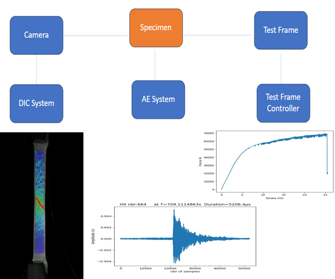

Mechanical Testing: DIC & MTS

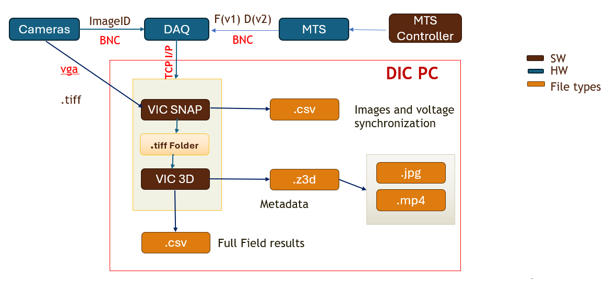

Data COLLECTION

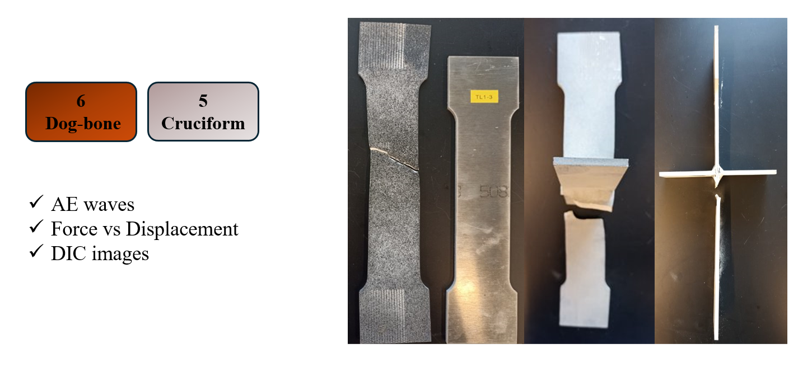

Visiualization

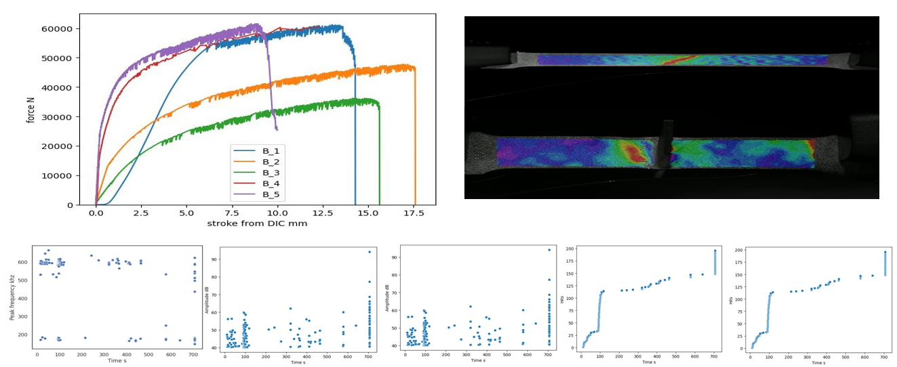

Analysis: Mahalanobis

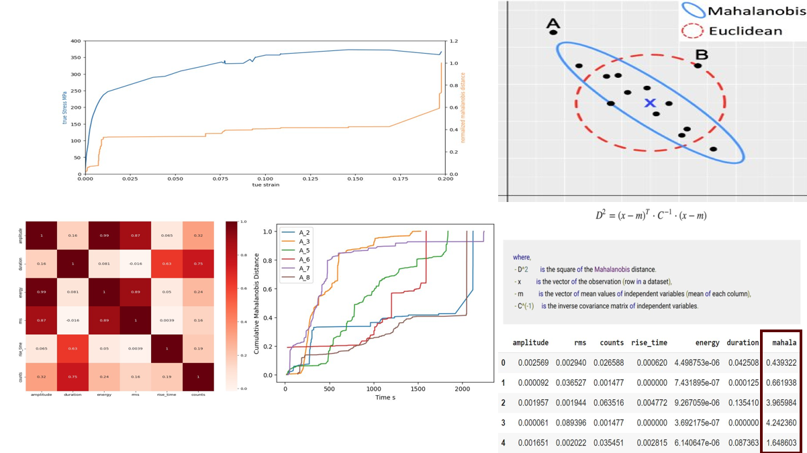

# Data preprocessing

Data concatenation and features selection
Force :143578  samples

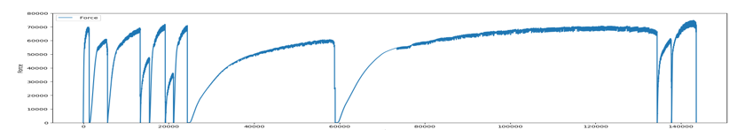

From 143578  to 9165 samples:
Despite the reduction of the number of samples, we have now another variable (feature) to help model the material deformation for better failure prediction

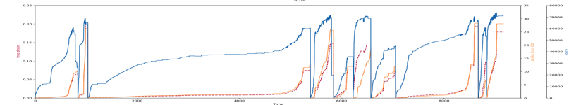

Force +stroke + Ae (7645 sample): for those test different acoustic DAQs were used to collect acoustic emission (linwave, AMSY6, Mistras) with different acquisition setups, what makes the data not usable to train a ml model 

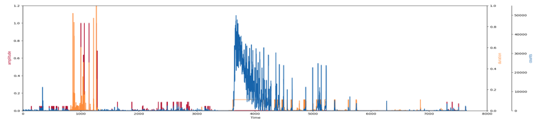

# Training process
## Force: Hyperparameters finetuning and model evaluation
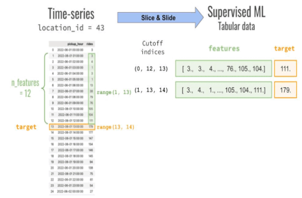

All data  normalized: devide by 100000 (the max of the UTM)
Deployable in real time

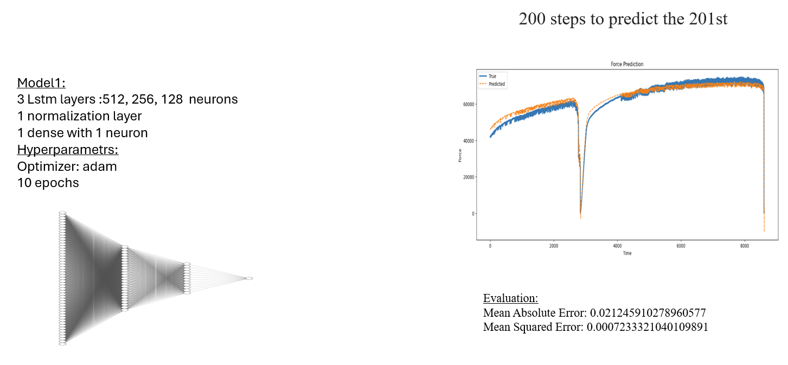

Window normalization (min,max): Deployable in real time

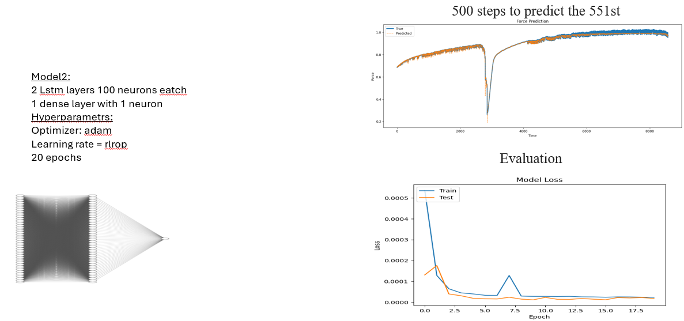
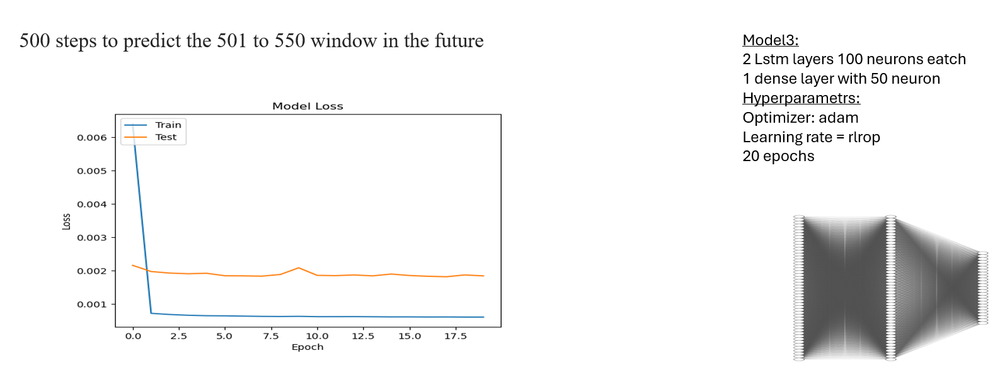

## Force+ Stroke: Hyperparameters finetuning and model evaluation
All data normalized (scaler): Deployable in real time

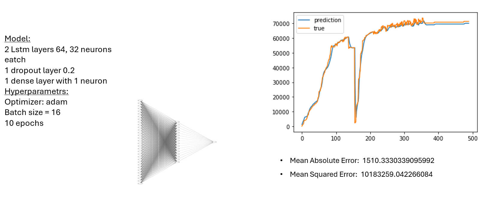

## other Methodes
### ARIMA
ARIMA(x, order=(20, 1, 0)) refers to an ARIMA model applied to a time series dataset x. ARIMA stands for AutoRegressive Integrated Moving Average, and the parameters inside `order=(p, d, q)` define the model's configuration. Here's a breakdown of each part:

  order=(p, d, q): These are the three parameters that define the ARIMA model:
 p (5): This is the number of autoregressive (AR) terms. It means the model uses the past 20 time periods to predict the current value.
 d (1): This is the number of differences required to make the time series stationary. A value of 1 means the model takes the difference of the time series once (i.e., it uses the change between consecutive observations).
q (0): This is the number of moving average (MA) terms. A value of 0 means the model does not use past forecast errors to predict future values.
Mean Squared Error: 60455869.929761134 
Mean Absolute Error: 3485.3404777847422

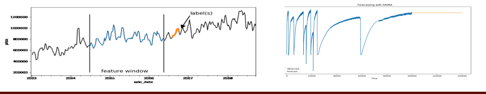

### Random Forest
Random Forest Regressor
Random forest regressor is an ensemble learning-based model. It builds multiple decision trees and combines the predictions to make better forecasting. Each tree is built using a subset of the data, and the final prediction is an average of the predictions from individual trees
3 steps to predict the 4th
Mean Squared Error (Random Forest): 4720748.941048399
3 steps predict the 34th
Mean Squared Error (Random Forest): 63983156.06426541

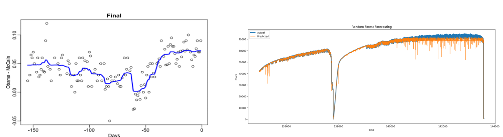

### SVM
`SVR(kernel='rbf', C=100, gamma=0.1)` :

**kernel='rbf'**:
   - The **kernel** is a function that transforms the input data into a higher-dimensional space where it may be easier to find a pattern or relationship.
   - `rbf` stands for **Radial Basis Function**, which is one of the most popular kernels for non-linear regression tasks. The RBF kernel allows SVR to handle non-linear relationships by mapping the data into a higher-dimensional space.
   - The RBF kernel is defined as:
     \[
     K(x, x') = \exp\left(-\gamma \|x - x'\|^2\right)
     \]
     where \( \gamma \) controls how much influence a single data point has on the overall model.

**C=100**:
   - **C** is the **regularization parameter** in SVR.
   - It controls the trade-off between achieving a low error on the training data and keeping the model simple to generalize well on unseen data.
   - A higher value of `C` (like 100 in this case) means the model will aim to fit the data more closely and may accept less error, which can potentially lead to overfitting.

. **gamma=0.1**:
   - **Gamma** is a parameter specific to the RBF kernel and controls the influence of individual training examples.
   - A lower value of `gamma` means that each point has a broader influence (the decision region will be smoother), while a higher value makes each point have a more localized effect.
   - In this case, `gamma=0.1` indicates that the influence of each data point will not be too localized but will affect a broader region of the feature space.
3 steps to predict the 4th
Mean Squared Error (SVR): 130941169.50495163

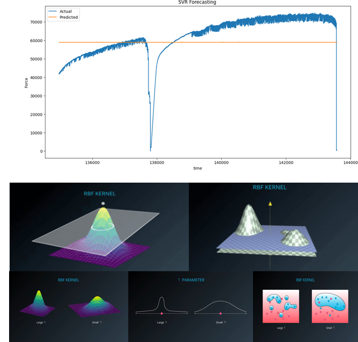

# Deplyement

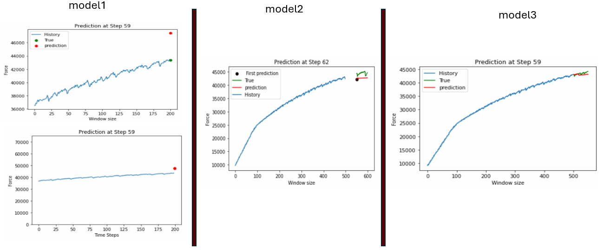
